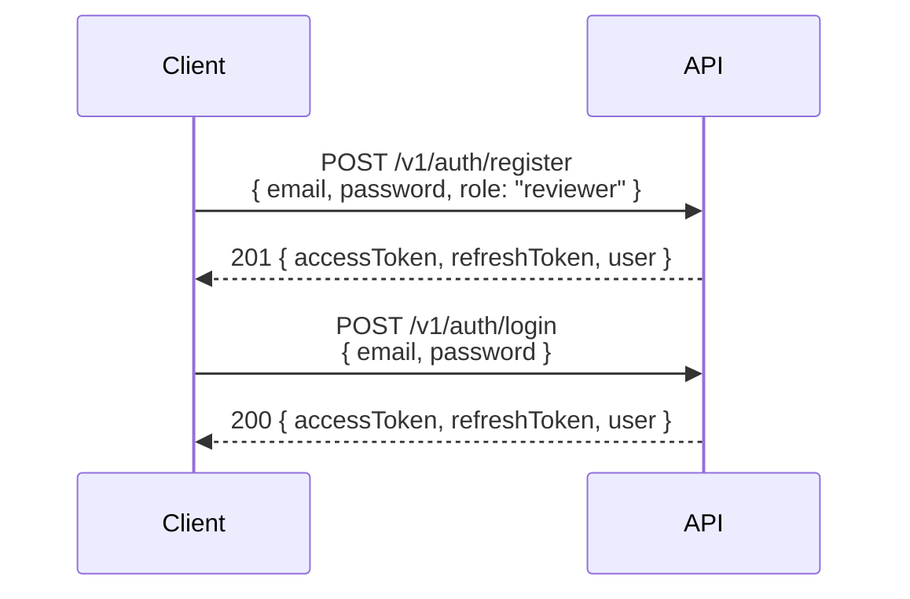
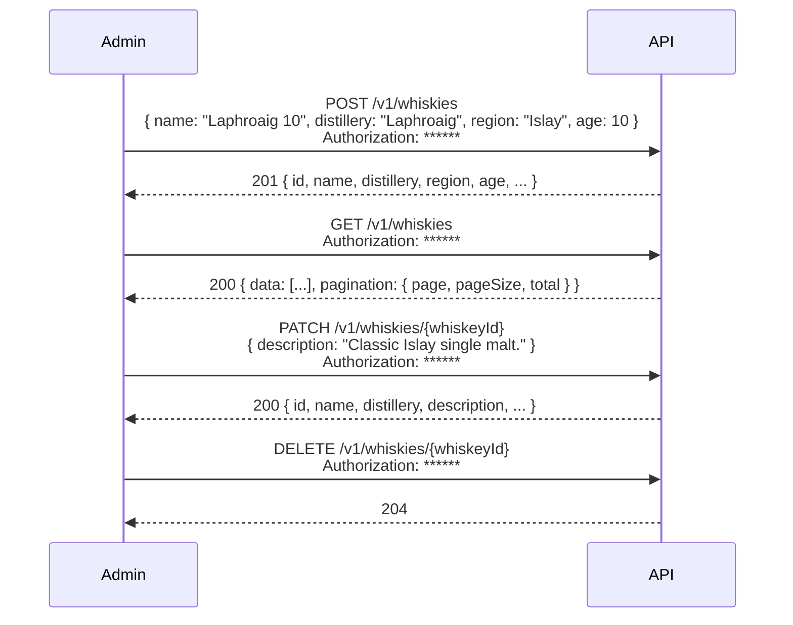
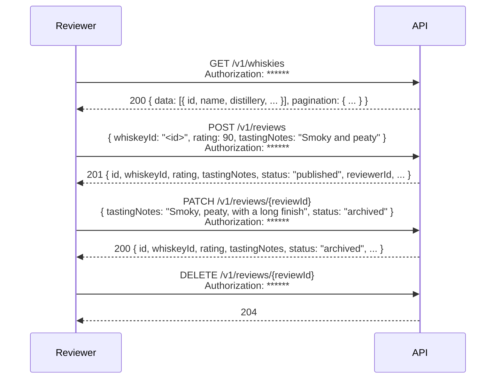
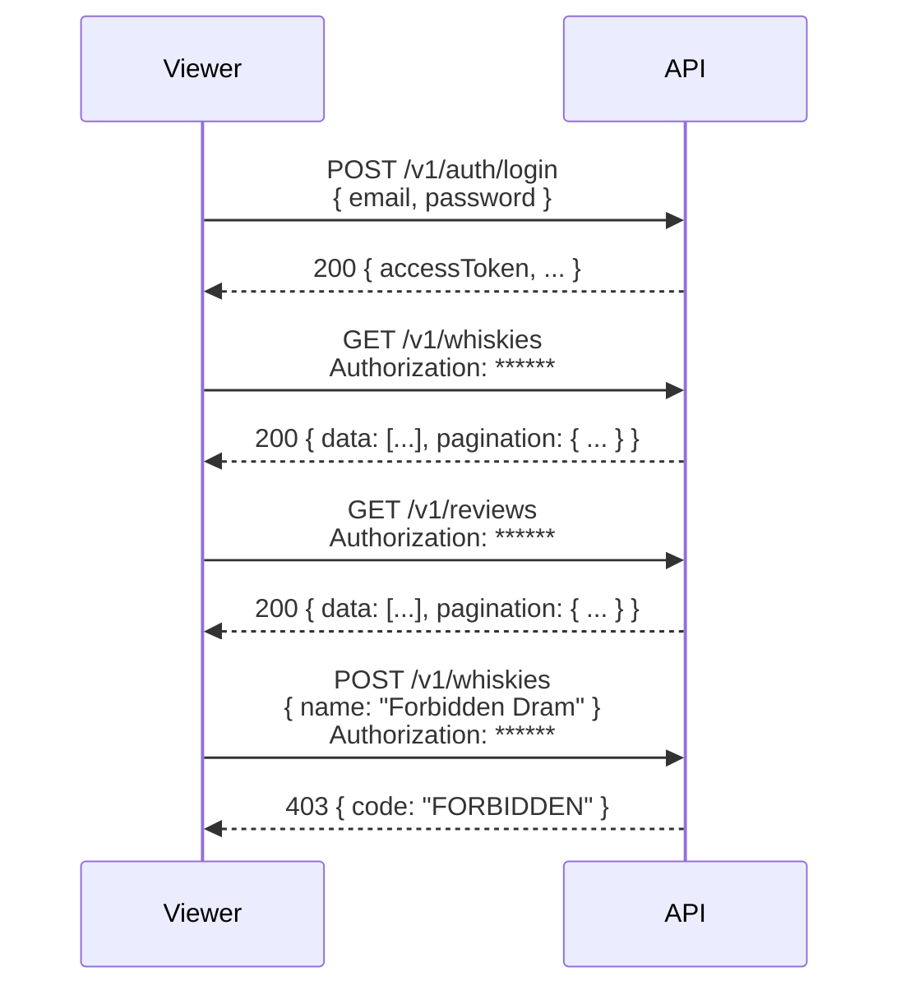
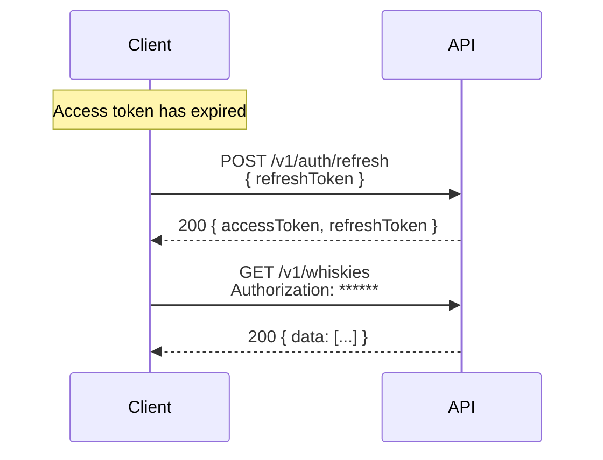

# Sequence Diagrams — Whiskey Reviews

---

## Flow 1: Register and Log In

---

## Flow 2: Admin Manages Whiskey Inventory

---

## Flow 3: Reviewer Submits a Review

---

## Flow 4: Viewer Browses Whiskies and Reviews

---

## Flow 5: Token Refresh

---

## Notes

- All authenticated requests include `Authorization: ****** (omitted from some diagrams for brevity).
- `4xx` error paths are covered by the auth matrix — see `auth-matrix.md`.
